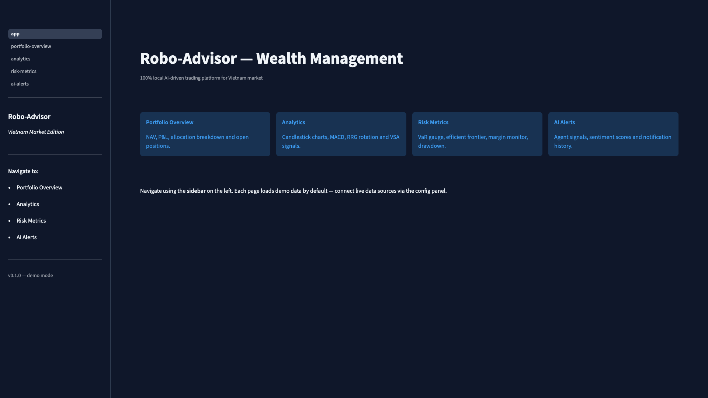
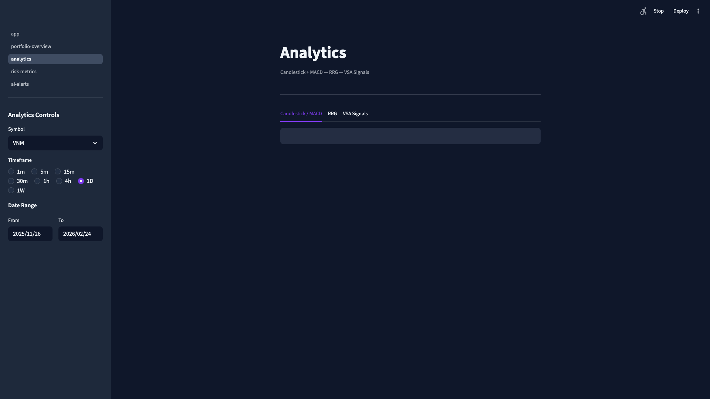
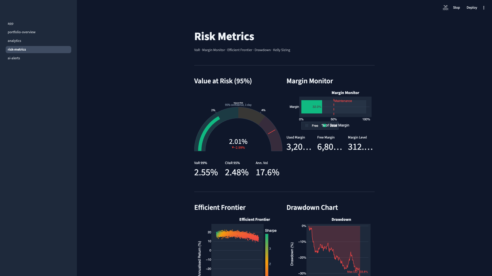
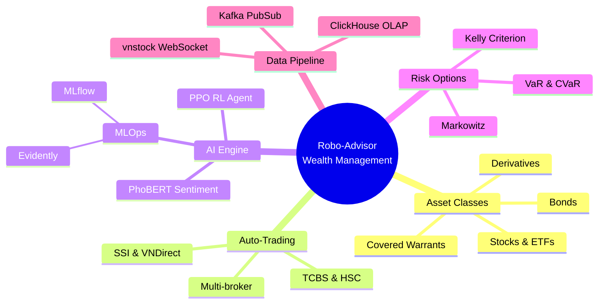
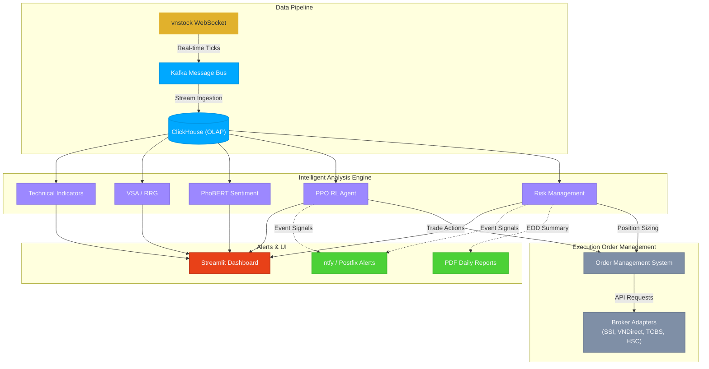

# Robo-Advisor Wealth Management

100% local multi-asset trading system with AI/RL for Vietnam market. Fully automated portfolio management supporting stocks, ETFs, covered warrants, bonds, and derivatives with real-time risk monitoring and intelligent decision-making.

## Demo

### Dashboard Landing Page



### Analytics — Candlestick, MACD, RRG, VSA



### Risk Metrics — VaR, Margin Monitor, Efficient Frontier, Drawdown



## Features



- **5 Asset Classes** — Stocks, ETFs, Covered Warrants, Bonds, Derivatives
- **Full Auto-Trading** — Multi-broker support (SSI, VNDirect, TCBS, HSC)
- **AI/ML Engine** — PPO RL agent (stable-baselines3) + PhoBERT sentiment analysis
- **Real-time Data** — vnstock WebSocket → Kafka streaming → ClickHouse OLAP
- **Risk Management** — VaR, CVaR, Kelly Criterion, Markowitz optimization, Call Margin monitor
- **Dashboard** — Streamlit multi-page app with dark theme, Plotly charts (candlestick, RRG, efficient frontier)
- **Notifications** — ntfy push + Postfix email + PDF daily reports
- **MLOps** — MLflow experiment tracking + Evidently data drift monitoring
- **Vietnam Market Compliance** — T+2.5 settlement, 0.1% tax, 0.3% broker fees

## Architecture



## Quick Start

```bash
# Install dependencies
uv sync --all-extras

# Copy env template
cp .env.example .env

# Start infrastructure (Kafka, ClickHouse, MLflow, etc.)
docker compose -f docker/docker-compose.yml up -d

# Run dashboard
uv run streamlit run src/ui/app.py
```

Open [http://localhost:8501](http://localhost:8501) in your browser.

## Project Structure

```
src/
├── data/           # vnstock WebSocket, Kafka producers/consumers, backfill
├── storage/        # ClickHouse client, schemas, migrations
├── analysis/       # Technical indicators, RRG, VSA, fundamental valuation
├── risk/           # VaR, Kelly criterion, Markowitz, call margin monitor
├── trading/        # Order manager, position tracker, reward function
│   ├── brokers/    # SSI, VNDirect, TCBS, HSC adapters + paper trading
│   ├── agents/     # PPO trading agent
│   ├── envs/       # Gymnasium trading environment
│   └── validators/ # T+2.5 settlement validator
├── ml/             # MLflow tracker, Evidently drift monitor
│   └── sentiment/  # PhoBERT sentiment classifier
├── ui/             # Streamlit dashboard (multi-page)
│   ├── pages/      # Portfolio, Analytics, Risk, AI Alerts
│   ├── charts/     # Candlestick, RRG, risk, portfolio charts
│   ├── components/ # Metric cards, data tables, sidebar filters
│   └── theme/      # Chart theme configuration
└── notifications/  # ntfy, Postfix, PDF report generator, scheduler
```

## Tech Stack

| Component | Technology |
|-----------|-----------|
| Language | Python 3.11+ |
| Package Manager | uv |
| Streaming | Kafka + Zookeeper |
| Storage | ClickHouse (OLAP) |
| ML/RL | stable-baselines3, Gymnasium, PyTorch |
| NLP | transformers (PhoBERT) |
| Dashboard | Streamlit + Plotly |
| MLOps | MLflow + Evidently |
| Notifications | ntfy + Postfix + FPDF2 |
| Infrastructure | Docker Compose (7 services) |

## Configuration

| File | Purpose |
|------|---------|
| `config/kafka.yaml` | Kafka broker, topics, consumer groups |
| `config/clickhouse.yaml` | Database connection, table schemas |
| `config/trading.yaml` | Trading params (T+2.5, fees, risk limits) |
| `config/notifications.yaml` | Alert thresholds, email recipients |
| `.streamlit/config.toml` | Dashboard theme (dark mode) |
| `.env` | API keys, broker credentials |

## Key Metrics

| Metric | Value |
|--------|-------|
| Unit Tests | 338 passing |
| Production Code | 7,143 lines |
| Broker Integrations | 4 (SSI, VNDirect, TCBS, HSC) |
| Technical Indicators | 5+ (MACD, Bollinger, ATR, Fibonacci, VSA) |
| Risk Models | 4 (VaR, Kelly, Call Margin, Markowitz) |
| Dashboard Pages | 4 (Portfolio, Analytics, Risk, AI Alerts) |

## Development

```bash
# Run tests
uv run pytest

# Run with coverage
uv run pytest --cov=src --cov-report=term-missing

# Lint
uv run ruff check src/ tests/

# Type check
uv run mypy src/
```

## License

Private — All rights reserved.
